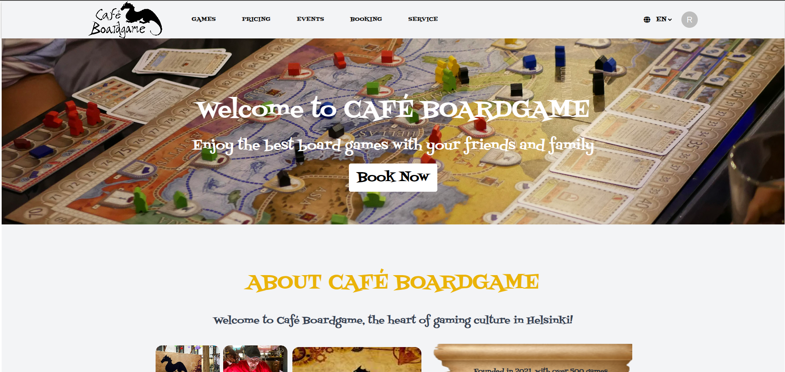

# BoardGameCafe

A full-stack web application for managing a real-life board game café — supporting table reservations, game selections, event browsing, Stripe payments, and a powerful admin panel (CMS).



---

## Table of Contents

1. [Project Description](#project-description)  
2. [Tech Stack](#tech-stack)  
3. [Features](#features)  
4. [Screenshots](#screenshots)  
5. [Setup Instructions](#setup-instructions)  
6. [Folder Structure](#folder-structure)  
7. [Team Contributions](#team-contributions)  
8. [Planned Features](#planned-features)

---

## Project Description

**BoardGameCafe** is a modern web platform developed as a part of our software development curriculum at **Varia Vantaa Vocational College**.

The platform is used by a real café and allows users to:

- Reserve tables and optionally select board games
- View pricing, menu, and upcoming events
- Complete payment through **Stripe Embedded Checkout**
- Admins can manage ALL content via an internal CMS-style panel

---

## Tech Stack

**Frontend**
- React (Vite)
- Tailwind CSS + MUI
- i18next (multilingual support)
- SweetAlert2

**Backend**
- Node.js + Express
- MongoDB + Mongoose
- Stripe API
- JWT for authentication
- Moment-Timezone

---

## Features

### User
- ✅ Table reservation form (with availability filtering)
- ✅ Optional game request
- ✅ Email + phone contact
- ✅ Multi-step booking flow
- ✅ Stripe embedded checkout
- ✅ View past bookings (for authenticated users)
- ✅ Multilingual: English + Finnish

### Admin
- ✅ Dashboard with upcoming bookings
- ✅ CMS-style editors for:
  - Tables
  - Pricing
  - Events
  - Working hours + special holiday overrides
- ✅ See and track payment statuses

---

## Screenshots


---

## Setup Instructions

### 1. Clone the repo

```bash
git clone https://github.com/irychkov/boardgamecafe.git
cd boardgamecafe
```

### 2. Backend Setup

```bash
cd backend
npm install
touch back.env
```

Fill in `.env`:

```env
MONGO_URI=your_mongo_uri
STRIPE_SECRET_KEY=your_stripe_secret
FRONTEND_URL=http://localhost:5173
PORT=5000
JWT_SECRET=your_secret
JWT_REFRESH_SECRET=your_secret
```

Then run:

```bash
npm run dev
```

### 3. Frontend Setup

```bash
cd frontend/cafe-front
npm install
touch .env
```

Fill in `.env`:

```env
VITE_APP_STRIPE_PUBLIC_KEY=your_stripe_public_key
VITE_API_URL=http://localhost:5000
```

Then run:

```bash
npm run dev
```
## Folder Structure

```plaintext
boardgamecafe/
├── backend/
│   ├── models/
│   ├── routes/
│   ├── utils/
│   └── server.js
├── frontend/
│   └── cafe-front/
│       ├── components/
│       ├── routes/
│       ├── context/
│       └── main.jsx
└── screenshots/
```

---

## Team Contributions

### [@Sephrodite](https://github.com/Sephrodite)
- Created booking form using MUI
- Fetcher for games
- Brought real café customer insights
- Helped shape user flow and usability

### [@Nasrin-MT](https://github.com/Nasrin-MT)
- Designed static pages (Contact, About, etc.)
- Built style guide and UI with Figma
- Translated content to Finnish (i18n)

### [@Jina-Eunjin](https://github.com/Jina-Eunjin)
- Designed services, pricing, and menu components
- Styled with Tailwind CSS
- Currently developing profile and my-bookings page (backend + frontend)

### [@RychkovIurii](https://github.com/RychkovIurii)
- Developed the full backend (Express, MongoDB)
- Integrated payment
- Built admin panel logic and interface
- Connected booking logic with payment and availability filtering

---

## Planned Features

- Email confirmations for bookings
- Booking reminders
- Booking edits from profile
- Public event calendar
- Validations
- Publish on Render

