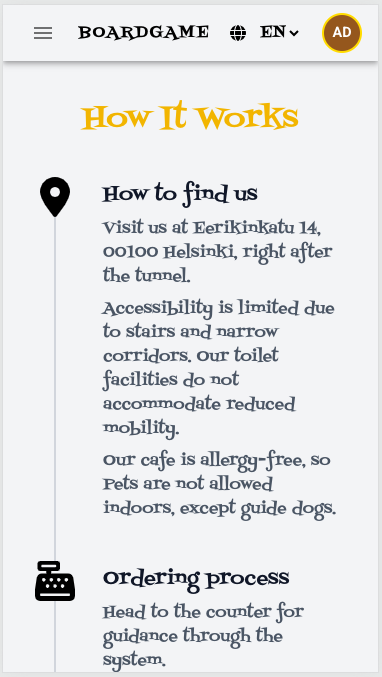

# BoardGameCafe

A full-stack web application for managing a real-life board game café — supporting table reservations, game selections, event browsing, Stripe payments, and a powerful admin panel (CMS).

<div style="display: flex; justify-content: center; gap: 10px;">
    
    
</div>

---

## Table of Contents

1. [Project Description](#project-description)  
2. [Tech Stack](#tech-stack)  
3. [Features](#features)  
4. [Screenshots](#screenshots)  
5. [Setup Instructions](#setup-instructions)  
6. [Folder Structure](#folder-structure)  
7. [Team Contributions](#team-contributions)  
8. [Planned Features](#planned-features)  
9. [Testing](#testing)  
10. [UX & UI Highlights](#ux--ui-highlights)  

---

## Project Description

**BoardGameCafe** is a modern web platform developed as a part of our software development curriculum at **Varia Vantaa Vocational College**.

The platform is used by a real café and allows users to:

- Reserve tables and optionally select board games
- View pricing, menu, and upcoming events
- Complete payment through **Stripe Embedded Checkout**
- Admins can manage ALL content via an internal CMS-style panel  
- Pulls live game collection from **BoardGameGeek** profile  
- Basic backend unit tests using **Jest** were implemented early to validate booking time overlaps, working hours logic, and input validation

---

## Tech Stack

**Frontend**
- React (Vite)
- Tailwind CSS
- MUI components
- i18next (multilingual support)
- SweetAlert2
- Day.js
- libphonenumber-js (phone validation)
- BoardGameGeek XML API (game collection sync)

**Backend**
- Node.js + Express
- MongoDB + Mongoose
- Stripe API (payments)
- JWT for authentication
- express-validator (input validation)
- Moment-Timezone for timezone handling
- Nodemailer (contact form emails)
- bcryptjs (password hashing)

---

## Features

- Seed scripts for database initialization (users, tables, menu items)

### User
- Table reservation form (with availability filtering)
- Optional game request
- Email + phone contact
- Multi-step booking flow
- Stripe embedded checkout
- Manage upcoming bookings and view past booking history on the My Bookings page (for authenticated users)
- Game collection fetched from BoardGameGeek
- Client-side + server-side validation for all forms
- Multilingual: English + Finnish

### Admin
- Dashboard with upcoming and past bookings
- View and manage all bookings (search, filter, edit, delete)
- Manage content via CMS-style editors:
  - Tables: Add/edit/delete tables with capacity
  - Pricing: Add/edit/delete prices
  - Menu: Add food & drinks with dynamic pricing
  - Events: Create and manage public events
  - Working Hours: Define weekly schedule
  - Special Days: Override opening hours for holidays or events
- See and track payment statuses

---

## Screenshots

### Desktop View

<div style="display: flex; justify-content: center; gap: 10px;">
    
    
</div>

### Responsive View

<div style="display: flex; justify-content: center; gap: 10px;">
    
    
    
</div>

---

## Setup Instructions

### 1. Clone the repo

```bash
git clone https://github.com/RychkovIurii/boardgamecafe
cd boardgamecafe
```

### 2. Backend Setup

```bash
cd backend
npm install
cp back.env.example back.env
```

Fill in `back.env`:

```env
MONGO_URI=your_mongo_uri
STRIPE_SECRET_KEY=your_stripe_secret
FRONTEND_URL=http://localhost:5173
PORT=5000
JWT_SECRET=your_secret
JWT_REFRESH_SECRET=your_secret
NODE_ENV=development
CONTACT_EMAIL=your_email@example.com
CONTACT_EMAIL_PASS=your_password
CONTACT_APP_PASS=your_password_for_app_from_google
```

Then run:

```bash
npm run dev
```

### 3. Frontend Setup

```bash
cd frontend/cafe-front
npm install
cp .env.example .env
```

Fill in `.env`:

```env
VITE_APP_STRIPE_PUBLIC_KEY=your_stripe_public_key
VITE_API_URL=http://localhost:5000
```

Then run:

```bash
npm run dev
```

### 4. Run with Docker Compose

Docker and Docker Compose provide an easy way to boot the whole stack without installing Node locally.

1. Install Docker (Desktop or Engine).
2. Update the provided env samples if needed:
   ```bash
   cp backend/back.env.example backend/back.env
   cp frontend/cafe-front/.env.example frontend/cafe-front/.env
   # docker.env is used directly by compose; edit it with your local secrets
   ```
   - For Docker Compose, the backend defaults to `mongodb://mongo:27017/cafeboardgame`.
   - Update `docker.env` whenever you need to change API URLs, Stripe keys, or other shared settings.
3. From the project root run:
   ```bash
   docker compose up --build
   ```
4. Visit the app:
   - Frontend: <http://localhost:5173>
   - Backend API: <http://localhost:5000>

On first boot the `seed` service runs automatically and populates MongoDB (core data + menu items) if it is empty. Subsequent runs detect existing data and skip reseeding.

Shut everything down with `docker compose down` (add `-v` to also remove the Mongo data volume).

- MongoDB data persists in `./mongo/db_mounted`. Delete the folder if you want a fresh database.
- All services run on the shared `cafe-network`, so they can reach each other using service names (e.g., `mongodb://mongo:27017`).

#### Makefile shortcuts

The project root includes a `Makefile` wired to the Compose commands:

- `make` / `make up` – build images and start everything in the background
- `make down` – stop and remove the stack
- `make stop` / `make restart` – pause or restart running containers
- `make logs` (or `logs-backend`, `logs-frontend`) – tail service logs
- `make shell-backend` / `make shell-frontend` – open a shell inside a running container
- `make fclean` – tear everything down, remove volumes, and prune Docker artifacts labelled `project=cafeboardgame`
- `make prune` – run the Docker prune step without stopping containers first
- `make re` – equivalent to `make fclean` followed by `make up`

## Folder Structure

```plaintext
boardgamecafe/
├── backend/
│   ├── config/                 # DB, seeds and server config
│   ├── controllers/            # Express route handlers
│   ├── middleware/             # Auth, validation, and error handling
│   ├── models/                 # Mongoose schemas
│   ├── routes/                 # API endpoints
│   ├── src/                    # Service logic
│   ├── tests/                  # Jest test files
│   ├── utils/                  # Helpers (validators, transformers, etc.)
│   ├── back.env                # Environment config (not committed)
│   ├── back.env.example        # Sample variables
│   ├── Dockerfile              # Backend container image
│   ├── jest.config.js          # Jest configuration
│   ├── package.json
│   └── server.js               # App entry point

├── frontend/
│   └── cafe-front/
│       ├── api/                # Axios config
│       ├── components/         # React components
│       ├── context/            # Global state and auth
│       ├── routes/             # Page-level route components
│       ├── src/                # Assets, static files, styles
│       ├── languages/          # i18n translations
│       ├── utils/              # Test helpers and utility functions
│       ├── index.html
│       ├── main.jsx            # Frontend entry point
│       ├── tailwind.config.js
│       ├── vite.config.js
│       ├── package.json
│       ├── Dockerfile
│       ├── .env
│       └── .env.example
├── docker.env                  # Environment shared by Docker Compose
├── docker-compose.yml
├── .dockerignore
├── mongo/
│   ├── Dockerfile             # Mongo image definition
│   └── db_mounted/            # MongoDB data (gitignored)
```

---

## Team Contributions

### [@Sephrodite](https://github.com/Sephrodite)
- Built the foundation of the **BookingForm** using MUI Stepper, inputs, and validations
- Implemented inline validations, duration limits, min/max players
- Implemented interactive table selector on the café floorplan map
- Styled the booking UI across form steps with mobile responsiveness
- Connected form with backend and added time-picker handling
- Created the **game fetcher** using BoardGameGeek XML API
- Added game filters, search bar, pagination, and styling updates
- Enhanced UI with footer, floorplan layout, modal for events, and table selector
- Conducted extensive **manual testing** throughout dev
- Contributed to **merging, bug fixes, and collaboration across branches**
- Brought real café insights to help design booking flow & UX


### [@Nasrin-MT](https://github.com/Nasrin-MT)
- Designed and implemented static pages: Contact, About, Privacy Policy, How It Works
- Built the color palette, font selection, and UI guide using **Figma**
- Implemented centralized **color theme logic**, enabling full site-wide color updates from a single config file
- Applied consistent color and typography styles across the app using Tailwind and MUI overrides
- Styled BookingForm, Menu, GameCards, Hero, Footer, and navigation elements
- Contributed heavily to responsive styling and layout polishing
- Managed **i18n translation updates** across pages and languages (EN/FI)
- Linked all content-rich pages (policy, contact, footer, event hero, gallery, etc.)
- Implemented visual consistency and accessibility improvements
- Reviewed and merged PRs related to styles, translations, and public UI sections


### [@Jina-Eunjin](https://github.com/Jina-Eunjin)
- Designed and implemented the Service, Pricing, About, and How It Works pages developing custom components for each page
- Developed the **User Profile** and **My Bookings** pages (backend + frontend)
- Implemented functionality to edit and delete user bookings
- Styled key sections using **Tailwind CSS**, including admin pages, dashboard, forms, and hero sections
- Standardized responsive layouts and class naming conventions across components
- Worked on **admin dashboard UX**, layout updates, and booking status features
- Refined i18n logic for dynamic button text and multi-language support
- Added avatar initials display, profile styling, and dashboard UI tweaks
- Implemented **email integration** via contact form backend
- Contributed regularly to merging branches, fixing style bugs, and improving frontend logic across the app


### [@RychkovIurii](https://github.com/RychkovIurii)
- Architected and implemented the **backend** using Node.js, Express, MongoDB, and Mongoose
- Designed modular REST APIs for bookings, users, payments, tables, events, working hours, and menus
- Implemented **JWT authentication**, **role-based access**, and **secure routes**
- Built comprehensive **admin CMS**, including dashboards and editors (tables, pricing, menu, events, hours)
- Integrated **Stripe payments** with embedded checkout, payment tracking, and confirmation emails
- Wrote custom **validation middleware** with `express-validator`, and custom utils for overlaps, time, hours
- Developed a **multi-step booking form**: real-time validation, availability logic, table suggestion, and feedback
- Created seed scripts for DB: users, tables, games, pricing, events — and helper tools for testing
- Added **Forgot Password**, profile edit, multilingual errors, and alerts (SweetAlert2 + i18n)
- Implemented Jest tests for booking overlaps, working hours, and validation early in development
- Maintained responsive UI logic, merged branches, authored detailed commits, and led cross-feature coordination
- Deployed full-stack app to **Render**, ensured token-based auth compatibility with platform limitations
- Managed project roadmap, internal design decisions, and GitHub pull request workflows

### [@mochoteimoso](https://github.com/mochoteimoso) — 💬 Big thanks!
- Edited and improved **English and Finnish text** content across the app
- Helped refine language tone, clarity, and overall readability
- Reviewed i18n translation files and improved multilingual consistency

### [@ThomasHillebrink](https://github.com/ThomasHillebrink)
- Added **Jest testing** examples for frontend components (e.g., Events page)
- Provided helpful suggestions and ideas to improve the **UI and UX**

---

## Planned Features

- Email reminders for bookings
- Public event calendar
- Booking analytics (e.g. most used tables, top games)
- Deployment on CDN for media hosting

---

## 🧪 Testing

- Backend unit tests using **Jest** (early phase)
- Covered modules:
  - Booking time overlap logic
  - Working hours and holiday overrides
  - Input validation middleware
- Client-side and server-side validations for robust form processing
- Goal: catch issues early and prevent invalid data

---

## 🎨 UX & UI Highlights

- **Booking Form**
  - MUI Stepper with clear progress indication
  - Inline field validation with error messages
  - Real-time seat suggestion based on group size and capacity
  - Duration selector (slider)
  - Time picker for accurate booking time
  - Fully responsive layout, optimized for mobile

- **Form Validation**
  - Frontend: regex + `libphonenumber-js` + translated alerts
  - Backend: express-validator + centralized error middleware
  - Consistency and security on both layers
